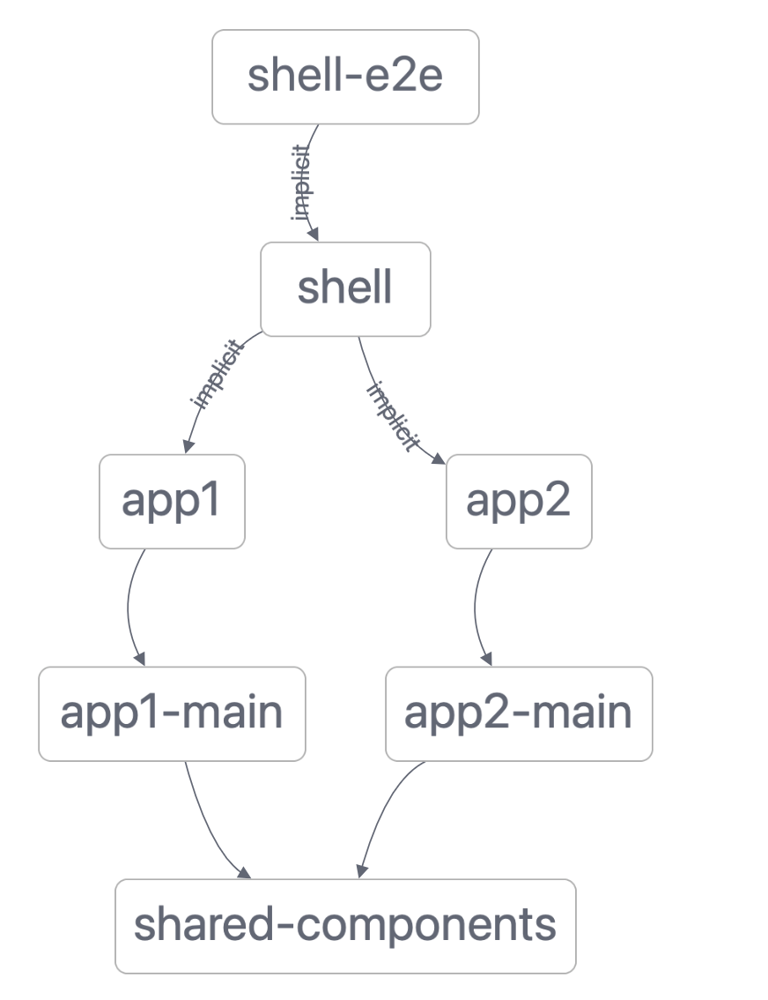
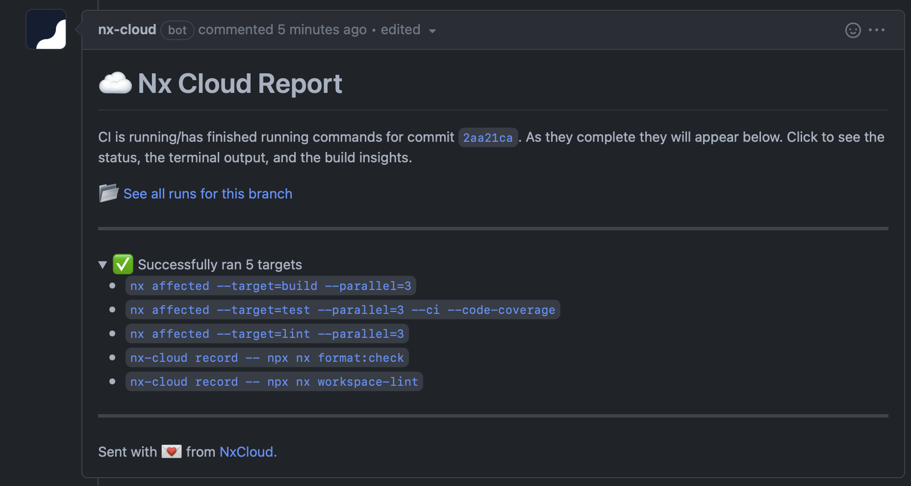
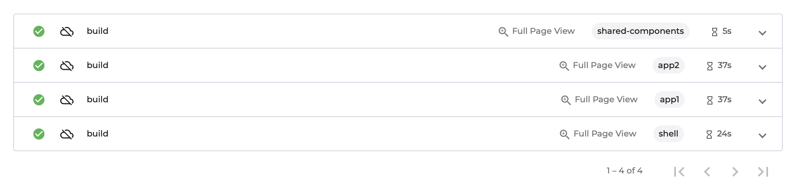

# Nx: Faster Angular Builds Using Module Federation

Building large Angular applications can take a long time. It's not uncommon to see 30+-minute builds in CI.

Things contributing to the build time are:

1. Compilation: Compiling the Angular components and other TS sources.
2. Linking: Bundling, tree-shaking, minification.

You could optimize the steps but at a certain scale there is only one way to make your CI consistently fast, and it is to distribute your builds. To do that you need to split you monolithic build into multiple independent build processes.

There are two ways to make the build incremental:

1. Make libraries buildable (aka horizontal incrementality).
2. Use module federation to split your app into several independently buildable apps/slices (aka vertical incrementality).

This repo shows how to use both.

## Example

This repo has an applicationi called `shell`. It loads two separate slices (`app1` and `app2`) using module federation. The `app1` app depends on the `app1-main` lib. The `app2` app depends on the `app2-main` lib. The `app1-main` and `app2-main` libs depend on `shared-components`.



### Serving the application

```bash
nx serve shell
```

This will build `shared-components` and will run three dev servers (app1, app2, and shell) and wire them up using module federation.

### Building the application

```bash
nx build shell
```

This will run 4 build tasks:

- `nx build shared-components`
- `nx build app1`, `nx build app2`
- `nx build shell`

Note that `app1` and `app2` can be built in parallel, but they have to wait for `shared-components` to be built because their build processes will read the `dist` output of `shared-components`.

You can also serve `shell` with only subset of the apps, as follows:

```bash
nx serve shell --apps=app1
```

`app2` will be retrieved from cache, so it will be available in the app, but won't be changeable. This can drastically speed up the serve time, and how long it takes to see your edits on the screen.

### Testing the application and the libraries

There is no `dependsOn` set up for the test target, so running `nx test shell` will only run the tests of the `shell` project itself.

If you want to test `app1-main`, run `nx test app1-main`.

If you want to test everything, run `nx run-many --target=test --all`.

## Buildable shared-components

As mentioned above, there are two ways to split a single build into multiple units: using module federation (vertical) and using buildable libraries (horizontal).

In our experience, making most libraries buildable can speed up the average build time on CI, but slows down the worst-case time and has a lot of negative implications on the local dev experience. Also, making libraries buildable can only improve the compilation time--it doesn't affect linking. Since linking often amounts to 40-50% of the total time, you have to use module federation to reduce your build time by 3+ times.

Having said that, it can be beneficial to make some libraries at the bottom of the dependency graph buildable (e.g., components). Such libraries are often big and slow to compile, and they aren't changed while developing the app itself. They are usually developed separately using something like Storybook (so the impact on the local DX is small). This repo illustrates this by making `shared-components` buildable.

Without Nx Cloud's distributed tasks execution, making buildable libraries work in CI is very hard. You need to build things in order, move files between agents etc. Thankfully Nx Cloud does it automatically. It will build `shared-components` library first and then, when agents build `app1` and `app2`, it will make sure that the result of building `shared-components` is fetched and placed in the right `dist` folder.

## CI setup

This is the CI setup using GitHub actions.

```yaml
jobs:
  main:
    name: Nx Cloud - Main Job
    uses: nrwl/ci/.github/workflows/nx-cloud-main.yml@v0.1.1
    with:
      parallel-commands: |
        npx nx-cloud record npx nx workspace-lint
        npx nx-cloud record npx nx format:check
      parallel-commands-on-agents: |
        npx nx affected --target=lint --parallel=3
        npx nx affected --target=test --parallel=3 --ci --code-coverage
        npx nx affected --target=build --parallel=3

  agents:
    name: Nx Cloud - Agents
    uses: nrwl/ci/.github/workflows/nx-cloud-agents.yml@v0.1
    with:
      number-of-agents: 3
```

This setup will allocate 3 agents that will build/test/lint all the projects in a distributed fashion, in the right order, and in parallel.

Once they are done, they will post the following comment:



If you click on the links, you will the logs:



## Distribution and Caching

How does CI work in this setup?

One of the agents will start building `shared-components`. While this is happening, other agents cannot start building `app1` and `app2`, so they will start running tests and lint checks. When `shared-components` is built, agents will build `app1` and `app2` in parallel. Note, all of this happens without your having to do anything. Nx Cloud will move the right dist files between agents, so the experiene is the same as if you ran it on a single agent, just much faster.

If your only changes `app2`, then `shared-components` and `app1` won't be built at all. They will be retrieved from cache.

## Worst case time vs average case time

If you split your application into multiple apps/slices using module federation, and if you use Nx Cloud, you could drastically reduce your build time.

In the worst case scenario, where you change everything, the build time will be reduced to the slowest app/slice. Note the total computation will increase, but since it will run on multiple agents, the clock time will go down.

In the average case scenario, where you only change one slice of the app, the build time will be reduced even more. Most of the slices are small, so the average build time can be a 10th of the original build time. And the total computation will decrease as well.
